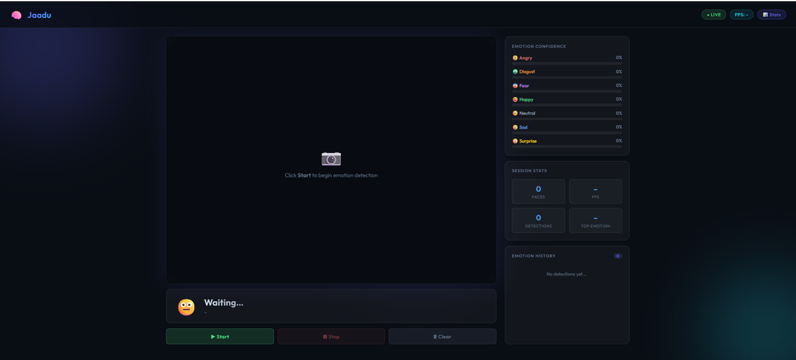
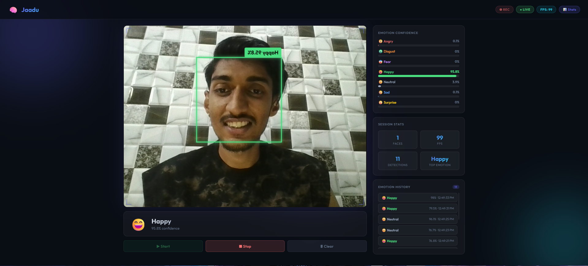
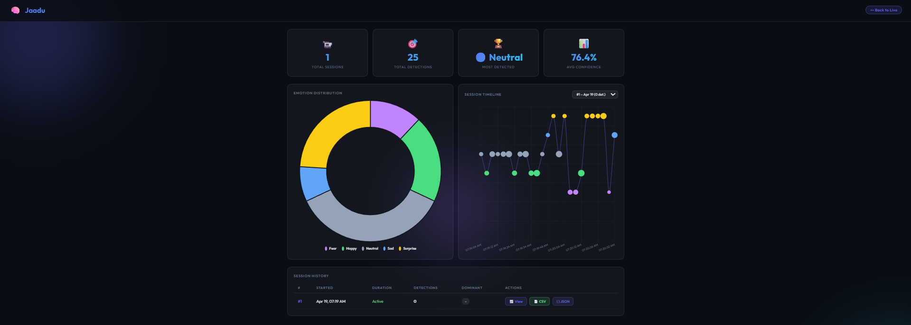

# Emotion-Recognition-System
Real-time Emotion Recognition System using OpenCV, TensorFlow Lite, Flask, and SQLite. Detects facial emotions from live webcam input, provides analytics dashboards, emotion history tracking, and real-time performance monitoring.

## Features

- Real-time face detection using OpenCV Haar Cascade
- Emotion classification using TensorFlow Lite
- Supports multiple face detection
- Live webcam processing
- Emotion confidence scoring
- Session history tracking
- Analytics dashboard
- SQLite database integration
- Lightweight and optimized for real-time performance

## Supported Emotions

- Angry
- Disgust
- Fear
- Happy
- Neutral
- Sad
- Surprise

## Tech Stack

### Frontend
- HTML
- CSS
- JavaScript

### Backend
- Flask
- Python

### AI/ML
- TensorFlow Lite
- OpenCV
- NumPy

### Database
- SQLite

## System Architecture

User Webcam
↓
Frontend (HTML/CSS/JS)
↓
Flask Backend
↓
Face Detection (OpenCV)
↓
Emotion Classification (TensorFlow Lite)
↓
SQLite Database
↓
Dashboard & Analytics

## Installation

Clone repository:

```bash
git clone https://github.com/yourusername/emotion-recognition-system.git
cd emotion-recognition-system
```

Install dependencies:

```bash
pip install -r requirements.txt
```

Run application:

```bash
python app.py
```

Open:

```text
http://localhost:5000
```


## Project Screenshots

## 📸 Project Screenshots

### 🏠 Home Screen



### 😀 Live Emotion Detection



### 📈 Emotion History


### 📊 Analytics Dashboard




## Technologies Used

- Python
- Flask
- OpenCV
- TensorFlow Lite
- SQLite
- HTML
- CSS
- JavaScript
- 

## Applications

- Human Computer Interaction
- Mental Health Monitoring
- Online Learning Analytics
- Customer Feedback Analysis
- Smart Assistants
- Behavioral Research

## Future Enhancements

- Mobile Application
- Emotion Detection from Video Files
- Audio Emotion Recognition
- Cloud Deployment
- Advanced Deep Learning Models

## Authors

- Sanjay Mayank Anil
- Jadhav Kalpesh Vilas
- Marathe Vaibhav Dinesh
- Patil Chaitali Subhash

## License

MIT License
